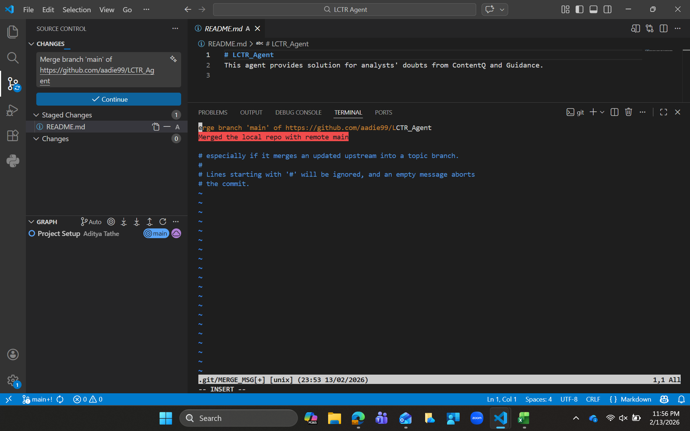

## Push
You have a local directory on your machine, and you need to push it to GitHub

1. Open the folder in VS Code
2. Check git status (if not, then initiate git)
3. Run following commands:
4. git add .
5. git commit -m ""
6. git branch -M main (-M forces rename of branch to main)
6. Copy the URL of your repo from GitHub
7. git remote add origin 'URL'
8. git remote -v (Verify the URL)
9. git push -u origin main (
    push = sends commit
    origin = GitHub repo
    main = branch name
    -u = sets upstream (so in future, u just need to run git push)
)

### Human errors:
1. If mistakenly pushed the repos in master branch, then rename the branch as main
-> git branch -m master main
2. If want to delete the master branch -> git push origin --delete master

## Errors
error: failed to push some refs = 
1. When you have created a repository on GitHub, then it already contains READme commit
2. And your local repo also has files, so another commit
3. So, you need to merge both the files first (local repo and GitHub repo)
4. To pull GitHub's main and allow merge -> git pull origin main --allow-unrelated-histories
5. Command to verify before/ after pull -> git log --oneline --decorate --graph --all
6. Pop up appears to confirm the merge of both repos

## To complete the merge
1. So, you are in INSERT mode (means VIM is in Insert mode)
2. Press Esc (to exit INSERT mode)
3. Type ':wq' = This will save the merge message and complete the merge

## To abort the merge
1. Press Esc
2. Type ':q!'

## Pull
